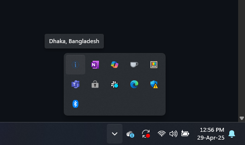

# IP Location Tray App

A simple Windows tray app built with **Electron** and **Node.js** that displays your current IP-based location (City, Country) when you hover over the tray icon.

Useful if you frequently switch VPNs or networks and want to instantly check your routing location without opening a browser.

---

## Features

- 🛸️ Fetches your current IP location using a free API (`ip-api.com`)
- 🔄 Auto-refreshes the location at a regular interval
- 📍 Shows your City and Country in the tooltip
- 🔁️ Right-click tray menu to manually refresh or quit
- �� Minimal app footprint, runs silently in the background

---

## Screenshot



---

## Installation

### Prerequisites

- [Node.js](https://nodejs.org/) (v16 or later recommended)
- [npm](https://www.npmjs.com/)

---

### Setup

1. Clone the repository or download the code:

```bash
git clone https://github.com/your-username/ip-tray-app.git
cd ip-tray-app
```

2. Install dependencies:

```bash
npm install
```

3. Run the app:

```bash
npm start
```

---

## Usage

- When launched, the app will place an icon in the Windows system tray.
- Hover over the tray icon to see your current City and Country based on your public IP.
- Right-click the tray icon to:
  - **Refresh Now**: Manually fetch the latest IP location.
  - **Quit**: Exit the app.

---

## Configuration

You can adjust the **refresh interval** by modifying this line in `main.js`:

```javascript
setInterval(fetchLocation, 5 * 60 * 1000); // refresh every 5 minutes
```

For example, to refresh every 30 seconds:

```javascript
setInterval(fetchLocation, 30 * 1000);
```

---

## API Used

This app uses the free [ip-api.com](https://ip-api.com/) service to get IP geolocation data.

- No API key required for basic usage
- Fair use limits: 45 requests per minute

---

## Building a Standalone Executable

You can package this app as a `.exe` for Windows using [electron-builder](https://www.electron.build/).

Install electron-builder:

```bash
npm install --save-dev electron-builder
```

Add this to your `package.json`:

```json
"build": {
  "appId": "com.yourcompany.iplocationtray",
  "win": {
    "target": "nsis"
  }
}
```

Then build:

```bash
npm run dist
```

(Ask me if you want detailed packaging instructions.)

---

## License

MIT License.\
Feel free to use, modify, and distribute this project.

---

## Credits

- Built with [Electron](https://www.electronjs.org/)
- IP data provided by [ip-api.com](https://ip-api.com/)

---

### Future Ideas

- Show IP address alongside location
- Detect IP change instantly instead of polling
- Auto-start on Windows boot
- Notifications when the IP or location changes

